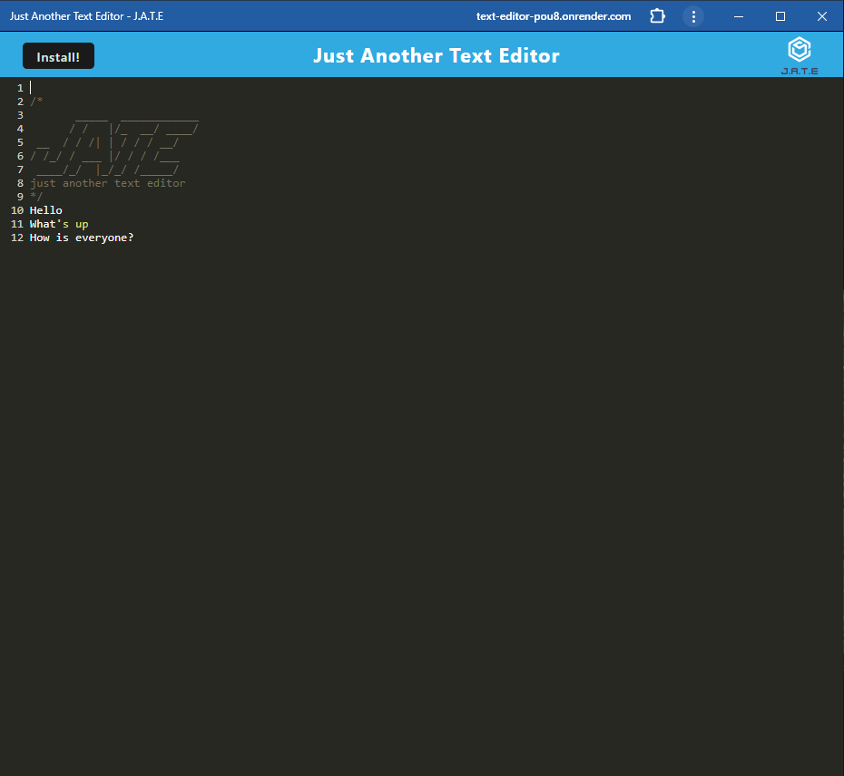

# Text-Editor
A PWA to edit text using idb

## Description

This program is a text editor, designed to run in the browser. It will also function offline.

Starting with an existing application, I will implement methods to get and store data in an IndexedDB database. THis application will be useful for storing and retrieving data.

This program is deployed using Render

## Table of Contents

- [User Story](#user-story)
- [Acceptance Criteria](#acceptance-criteria)
- [Access](#access)
- [Installation](#installation)
- [Usage](#usage)
- [Credits](#credits)
- [Questions](#questions)
- [License](#license)


## User Story

```md
AS A developer
I WANT to create notes or code snippets with or without an internet connection
SO THAT I can reliably retrieve them for later use
```

## Acceptance Criteria

```md
GIVEN a text editor web application
WHEN I open my application in my editor
THEN I should see a client server folder structure
WHEN I run `npm run start` from the root directory
THEN I find that my application should start up the backend and serve the client
WHEN I run the text editor application from my terminal
THEN I find that my JavaScript files have been bundled using webpack
WHEN I run my webpack plugins
THEN I find that I have a generated HTML file, service worker, and a manifest file
WHEN I use next-gen JavaScript in my application
THEN I find that the text editor still functions in the browser without errors
WHEN I open the text editor
THEN I find that IndexedDB has immediately created a database storage
WHEN I enter content and subsequently click off of the DOM window
THEN I find that the content in the text editor has been saved with IndexedDB
WHEN I reopen the text editor after closing it
THEN I find that the content in the text editor has been retrieved from our IndexedDB
WHEN I click on the Install button
THEN I download my web application as an icon on my desktop
WHEN I load my web application
THEN I should have a registered service worker using workbox
WHEN I register a service worker
THEN I should have my static assets pre cached upon loading along with subsequent pages and static assets
WHEN I deploy to Render
THEN I should have proper build scripts for a webpack application
```

## Access

To access this repository, please visit: https://github.com/avilwock/Text-Editor

To view online application please visit: https://text-editor-pou8.onrender.com/


## Installation

To install the application from github, please clone the repository and run an npm install. Then type npm start to build the project, and have it open on local host.

To install the application on your device, please visit the above online application link and press the install button in the top left corner.

## Usage

To use this program, open the file, either locally, or online, and type the text you would like to add. Closing and opening it will keep your data present.



## Credits

Logan Garland, Coding bootcamp, University of Irvine California

## Questions

For any questions, please contact me at: avilwock@gmail.com

## License

MIT License